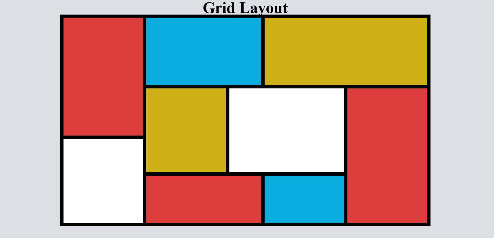

# 🎯 Grid Practice Layout

## 🔗 [Click Here to View Live Demo](https://practicegride.netlify.app/)

---

## 🖼️ Preview  

---

## 🚀 About  
A CSS Grid practice project built using HTML & CSS to improve layout designing skills.

---

## 🛠️ Tech Stack  
- HTML5  
- CSS3  

---

## 📚 What I Learned  
- CSS Grid  
- Grid positioning  
- Layout structuring  
- Responsive design concepts  

---

⭐️ Star the repo if you like it!
